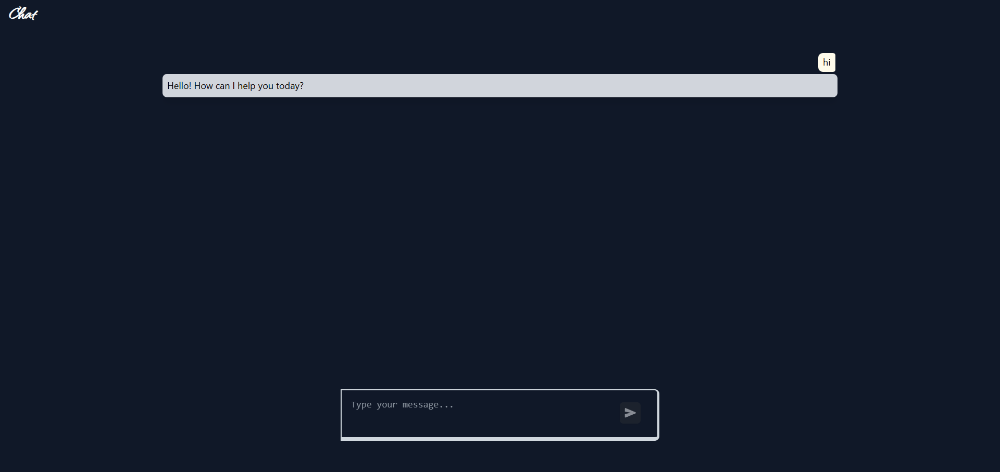

# Chat (Proof-of-Concept)

Chat is an experimental, in-development chat application demonstrating a local/embedded chat experience. It's powered by a custom fine-tuned AI model and features persistent chat history and real-time messaging.

**Note:** This is a proof-of-concept and is not intended for production use.

***

## Key Features

* **Custom Fine-Tuned AI Model**: The core of the chat experience is powered by a custom-trained model.
* **Persistent Chat History**: Conversations are stored locally, allowing you to pick up where you left off.
* **Real-Time Messaging**: Uses WebSockets for a low-latency, real-time communication experience.

***

## Video Demo

Click the image below to watch a short video demonstrating the application in action.

